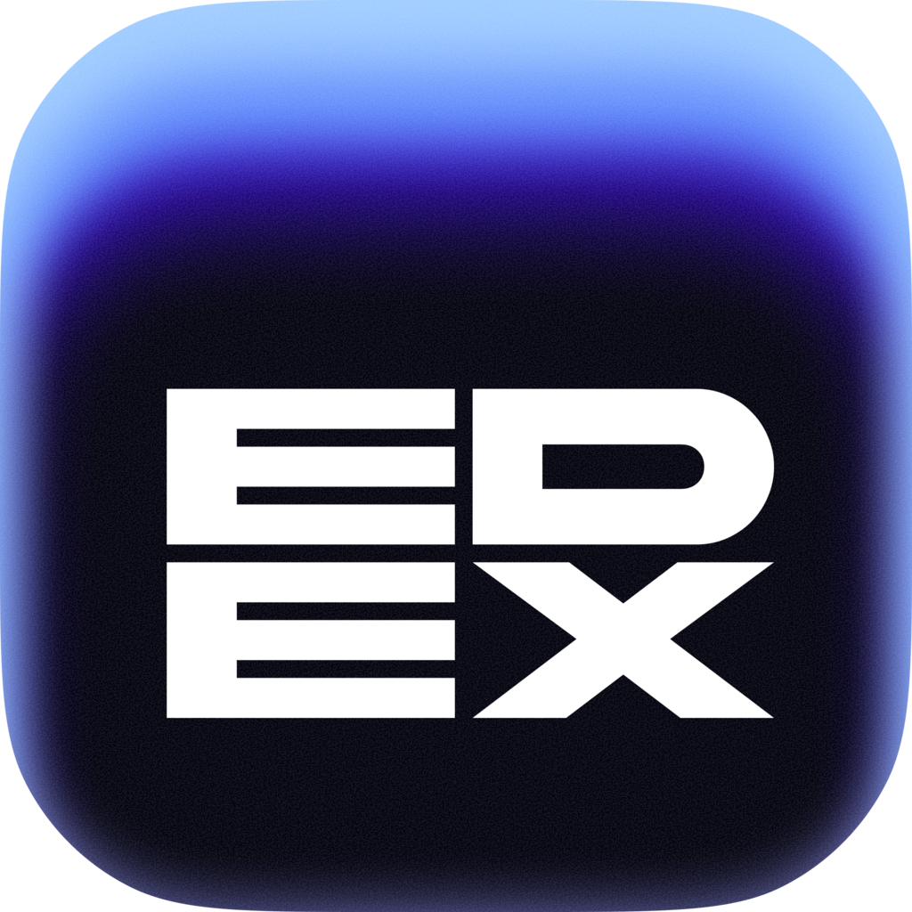

<p align="center">
  
</p>

<h1 align="center">EDEX</h1>

A maintained fork of [eDEX-UI](https://github.com/GitSquared/edex-ui) — the sci-fi desktop
terminal — brought up to date and made usable as a daily driver on Apple Silicon.

The upstream project was archived at v2.2.8 on Electron 12. This fork picks it up from there:
native arm64, a current Electron, patched dependencies, and a terminal that no longer plays a
sound on every keystroke.

> Looking for the original project's README, screenshots and credits? See
> [README.upstream.md](README.upstream.md).

## What is different from upstream

All changes are dated **2026-08-14** and are described per-commit in `git log`.

### Runtime and packaging
- **Electron 12 → 43** (Chromium 89 → 150), electron-builder 22 → 26, `electron-rebuild` →
  `@electron/rebuild`, `@electron/remote` 1 → 2, `node-pty` 0.10 → 1.1.
- **Native Apple Silicon build.** Upstream shipped x64, which ran through Rosetta and burned
  roughly 600% CPU while idle. Native arm64 brings that to about 40%.
- Refreshed `nanoid`, `pdfjs-dist`, `smoothie`, `systeminformation`, `ws`; `tar` pinned to
  >= 7.5.21 through `overrides` (transitive, critical advisory).

### Security
- **The terminal websocket binds to `127.0.0.1` only** and verifies `Origin`, accepting just
  the local renderer loaded from `file://`. Upstream listened on every interface and accepted
  whichever client connected first — the long-standing eDEX-UI exposure. Without the Origin
  check, a web page open in a browser could connect to the local port and drive the shell.
- **`eval` disabled in the PDF viewer** (`isEvalSupported: false`), closing CVE-2024-4367.

### Interface
- Renamed to EDEX throughout; settings live in `~/Library/Application Support/EDEX` and are
  migrated once from the old eDEX-UI folder.
- **Layout fixed for tall, non-16:9 displays.** Key widths were expressed in `vh`, which only
  lines up on 16:9; they are now `vw`, so rows, Enter and the spacebar stay in place.
- **Quiet by default:** no sound on keystrokes, terminal output, modals or directory
  refreshes. Enter keeps its confirmation sound, and the boot theme still plays.
- The glitch title screen is skipped — the boot log hands straight over to the UI.
- `LANG` defaults to `ru_RU.UTF-8` when unset; without it Cyrillic input came out as digits.
- RAM watcher no longer errors out on macOS memory accounting.

### Added
- **"Открыть в EDEX"** — a Finder quick action: right-click a folder, get a terminal in it.
  If EDEX is already running the folder opens in a free tab. See [extras/](extras/).

## Requirements

macOS on Apple Silicon, Xcode command line tools, Node.js and npm.

Other platforms are inherited from upstream and left untouched — the fork is only tested on
macOS arm64.

## Running from source

```sh
npm run install-darwin   # installs deps and rebuilds node-pty against Electron's ABI
npm start
```

## Building a distributable

```sh
npm run prebuild-darwin
./node_modules/.bin/electron-builder build -m --dir
npm run postbuild-darwin
```

The app lands in `dist/mac-arm64/EDEX.app`. It is unsigned, so ad-hoc sign it before use:

```sh
codesign --force --deep --sign - dist/mac-arm64/EDEX.app
```

If signing fails with resource-fork or xattr errors, copy the bundle out of any iCloud-synced
folder first (`ditto` to a local path strips the extended attributes that break signing), then
sign and move it into `/Applications`.

## Credits and attribution

eDEX-UI was created by **Gabriel "Squared" SAILLARD** ([gaby.dev](https://gaby.dev)) and
contributors, © 2017–2021. All of the original credits — including IceWolf for the sound
design and Rob "Arscan" Scanlon for the ENCOM Globe — are preserved in
[README.upstream.md](README.upstream.md).

This fork is maintained by Ilya Pitenin and carries no endorsement from the original author.
Please do not report issues with this fork to the upstream project.

## License

GPL-3.0, inherited from eDEX-UI — see [LICENSE](LICENSE) and [NOTICE.md](NOTICE.md).

As a derivative work this fork is distributed under the same terms: source is available, the
original copyright notices are kept, and the modifications are documented above and in the
commit history.
