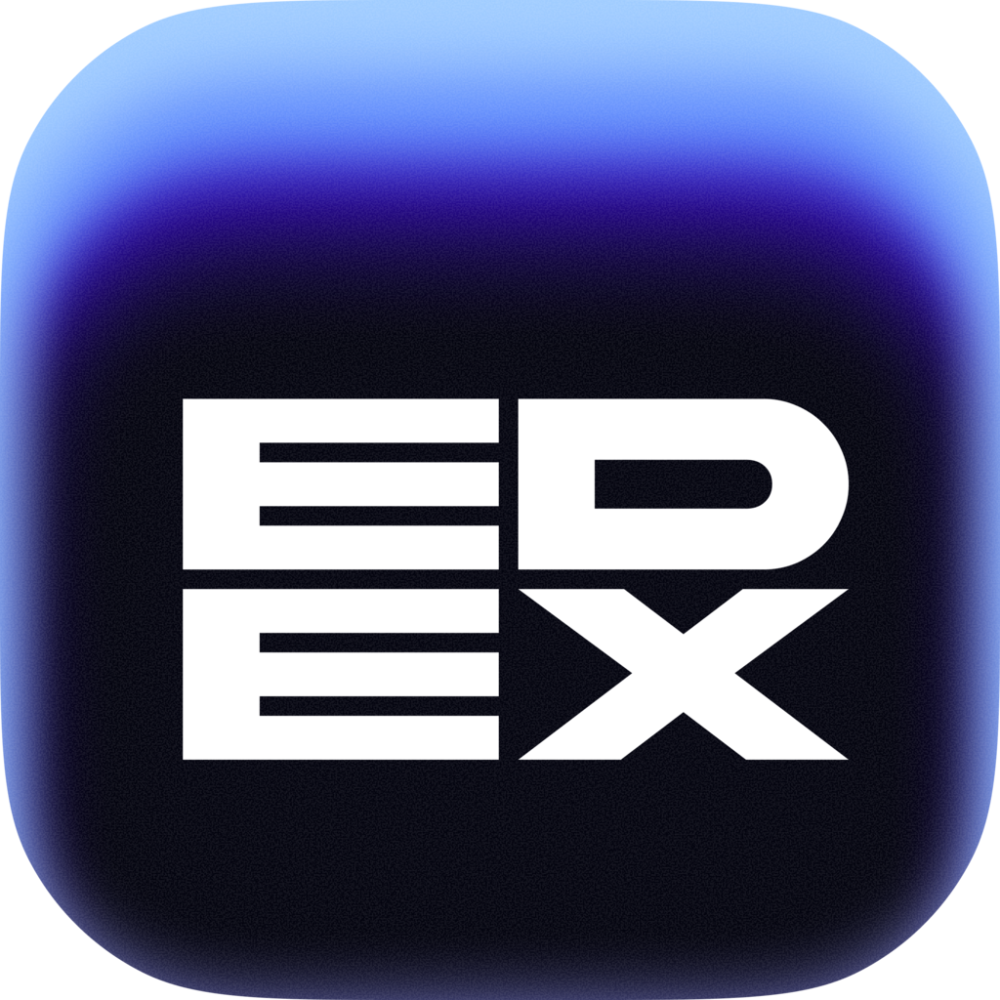

<p align="center">
  
</p>

<h1 align="center">EDEX</h1>

A maintained fork of [eDEX-UI](https://github.com/GitSquared/edex-ui) — the sci-fi desktop
terminal — brought up to date and made usable as a daily driver on Apple Silicon.

The upstream project was archived at v2.2.8 on Electron 12. This fork picks it up from there:
native arm64, a current Electron, patched dependencies, and a terminal that no longer plays a
sound on every keystroke.

> Looking for the original project's README, screenshots and credits? See
> [README.upstream.md](README.upstream.md).

## What is different from upstream

The fork's changes began on **2026-08-14** and are described per-commit in `git log`; the
[version history](#version-history) below says what each release brought. The security review
behind them, and its follow-up, is written up in [AUDIT.md](AUDIT.md).

### Runtime and packaging
- **Electron 12 → 43** (Chromium 89 → 150), electron-builder 22 → 26, `electron-rebuild` →
  `@electron/rebuild`, `@electron/remote` 1 → 2, `node-pty` 0.10 → 1.1.
- **Native Apple Silicon build.** Upstream shipped x64, which ran through Rosetta and burned
  roughly 600% CPU while idle. Native arm64 brings that to about 40%.
- Refreshed `nanoid`, `pdfjs-dist`, `smoothie`, `systeminformation`, `ws`; `tar` pinned to
  >= 7.5.21 through `overrides` (transitive, critical advisory).

### Security
- **The terminal websocket binds to `127.0.0.1` only** and verifies `Origin`, accepting just
  the local renderer loaded from `file://`. Upstream listened on every interface and accepted
  whichever client connected first — the long-standing eDEX-UI exposure. Without the Origin
  check, a web page open in a browser could connect to the local port and drive the shell.
- **Untrusted values are escaped before they reach the DOM** — process names, file names, volume
  labels, the contents of a file opened in the editor, keyboard layout files, values from
  `settings.json`, error text. Upstream interpolated them raw, which with node integration
  enabled meant a file named `` executed code the moment it was displayed.
  See [AUDIT.md](AUDIT.md).
- **Paths typed into the shell are quoted properly** — from the fuzzy finder and from clicks in
  the filesystem panel alike — so a folder named `$(curl …|sh)` or `'; rm -rf ~; '` stays a name.
- **Theme and keyboard layout names stay inside their folders**; a crafted name used to load a
  file from anywhere.
- **pdf.js updated** from 2.16 to 4.10, with `eval` disabled in the viewer (CVE-2024-4367).
- **Dependencies are not advisory-free right now.** As of 2026-09-30 `npm audit` reports high
  severity advisories against Electron 43.4.0 itself and the `undici` it bundles; moving to a
  patched Electron is a separate update, not part of this release.
- **The update checker is gone.** It fetched releases from the upstream repository on every
  launch and dropped the response into modal markup, `onclick` handler included.

**Known limitation:** the renderer still runs with `nodeIntegration: true` and
`contextIsolation: false`, inherited from upstream. The injection paths above are closed, but
the architecture offers no second line of defence — treat the app as trusting whatever you
open with it. Moving to a preload bridge is a rewrite of the window-to-main plumbing and has
not been attempted.

### Interface
- Renamed to EDEX throughout; settings live in `~/Library/Application Support/EDEX` and are
  migrated once from the old eDEX-UI folder.
- **Layout fixed for tall, non-16:9 displays.** Key widths were expressed in `vh`, which only
  lines up on 16:9; they are now `vw`, so rows, Enter and the spacebar stay in place.
- **The window is an ordinary window.** Upstream ran frameless and screen-sized in native
  fullscreen, with no close, minimise or zoom buttons, and refused to be moved or resized — so a
  second monitor was unreachable, since macOS cannot drag a window out of native fullscreen at all.
  It now opens with a title bar, filling the work area of the chosen display. `forceFullscreen` is
  off by default and editable in the settings editor rather than only in the JSON.
- **Quiet by default:** no sound on keystrokes, terminal output, modals or directory
  refreshes. Enter keeps its confirmation sound, and the start-up sequence keeps its own.
- The glitch title screen is skipped — the boot log hands straight over to the UI.
- **The startup animation lands where it started.** The terminal frame used to unfold, blink and
  jump to a different spot, and the keyboard spread across the whole screen before snapping into
  its corner. The frame now opens where it stays, and the keyboard fades in where it stands —
  together with the filesystem panel, which no longer waits for the side columns.
- `LANG` defaults to `ru_RU.UTF-8` when unset; without it Cyrillic input came out as digits.
- **Cyrillic in the interface font.** United Sans has none, so Russian file names were drawn in
  the system fallback — wider and heavier than the Latin next to them. Play's Cyrillic is now
  registered under the theme font's own name and fills the gap in every theme.
- **The on-screen keyboard lights up by physical key.** It used to match the character typed, so
  under a Russian input source the letters stayed dark.
- **A long path stays inside the filesystem panel.** It used to run out of the title bar and
  across the keyboard; now it takes the whole bar when it needs to and, past that, drops folders
  from the middle — `/Users/me/…/src/utils`.
- RAM watcher no longer errors out on macOS memory accounting.

### Added
- **`Ctrl+Shift+M` sends the window to the next display**, wrapping around at the end. It works
  in fullscreen too: the window steps out of its Space, moves and goes back in. Beats the
  `monitor` setting, which lists bare indices and only takes effect on a full restart.
- **Defaults are merged into an existing config on every launch**, so a setting or shortcut added
  in a new version reaches people who already have a `settings.json` — previously the defaults were
  written on first run only and never revisited. Values already in the file are left alone.
- **"Open in EDEX"** — right-click a folder in Finder, get a terminal in it. The entry sits in
  the main context menu next to Terminal's own, and opens the folder in a free tab when EDEX is
  already running. A small Swift agent embedded in the bundle publishes the service, since
  Electron cannot register one itself, and EDEX registers the agent with macOS on every launch.
  See [extras/](extras/).
- **Files dropped on the window are typed into the active tab as paths**, escaped the way
  Terminal.app does it. That is also what lets Claude Code turn a dropped image into an
  attachment.

## Version history

- **2.4.3** (2026-09-30) — two folders sent from Finder in quick succession each get their own tab.
  The second used to connect to the first one's shell, fail with an error dialog and leave its own
  shell running with no tab.
- **2.4.2** (2026-09-30) — "Open in EDEX" is back in the Finder menu. macOS registers the app but
  not the service agent inside it, so after a reinstall the entry was gone; EDEX now registers the
  agent itself on every launch.
- **2.4.1** (2026-09-30) — a tidy-up after the summer's branches, and the holes it turned up.
  Clicking a folder in the filesystem panel no longer runs anything in its name; file contents,
  volume labels, settings values and theme names are escaped or confined; the one-client limit on
  the terminal socket works. Quitting during start-up, a tab whose socket fails, any value in
  `shellArgs`, unreadable files and directories, empty fuzzy searches and fast PDF paging no longer
  crash or leave shells behind, and a custom `env` survives the settings editor. Underneath, the
  logic moved into tested helpers (121 tests), dead code and sounds went, and the Finder helper is
  compiled for the architecture being packaged.
- **2.4.0** (2026-09-30) — the on-screen keyboard follows any input language, files dropped on the
  window are typed in as paths, Russian names get a matching font, a long path stays inside the
  filesystem panel, the startup animation lands where it started, and the filesystem panel
  arrives with the keyboard and lists everything. A dev server on port 3000 no longer stops the
  app from starting (2026-09-11).
- **2.3.0** (2026-08-27) — an ordinary window with a title bar, `Ctrl+Shift+M` onto the next
  display, and `npm run start-app` to run from source as EDEX.
- **2.2.8 + fork** (2026-08-14 to 2026-08-16) — Electron 43 on native arm64, the security audit and
  its fixes, "Open in EDEX" in Finder, signing that keeps permissions, and non-ASCII directory names.

## Requirements

macOS 12 or later on Apple Silicon — Electron 43's floor — plus the Xcode command line tools,
Node.js and npm to build.

Other platforms are inherited from upstream and left untouched — the fork is only tested on
macOS arm64.

## Running from source

```sh
npm run install-darwin   # installs deps and rebuilds node-pty against Electron's ABI
npm start
```

`npm start` runs `electron src --nointro` — the boot log is skipped — which launches the Electron
bundle from `node_modules` and loads the project inside it — so macOS calls the app "Electron" in the menu bar, the Dock and the process
list, and shows Electron's icon. That name comes from that bundle's `Info.plist`; `app.setName()`
is documented as not affecting it.

```sh
npm run start-app        # same code, but running as EDEX
```

`start-app` builds an `EDEX.app` around the same Electron binary with our own `Info.plist` and icon,
and symlinks its app directory to `src/` — so it is EDEX everywhere macOS shows a name, while edits
still take effect on the next launch with no rebuild. The bundle lives in
`~/Library/Caches/edex-build/dev/` and is rebuilt only when the Electron version changes. See
[build/dev-app.js](build/dev-app.js).

Both share the config folder and the single-instance lock with an installed EDEX: with
`/Applications/EDEX.app` running, they hand their arguments to it and exit. The Finder service only
ever talks to the installed app.

## Checks

```sh
npm run lint   # ESLint, tuned for real defects rather than style; expected to stay at zero warnings
npm test       # unit tests on node:test
```

The tests cover everything in `src/utils/` and `build/lib/`: escaping and shell quoting, config
seeding and the shell environment, argv, origin and port handling, the keyboard's slot map, dead
keys and control sequences (held to output recorded from the code they replaced), path fitting,
number formatting, and the names the build and the Finder helper must agree on.

Anything that needs a running app is in [SMOKE.md](SMOKE.md); run through it after a build.
[CLAUDE.md](CLAUDE.md) collects the conventions and the platform quirks worth knowing before
changing anything here.

## Building a distributable

```sh
npm run build-darwin
```

That is the whole thing — npm runs `prebuild-darwin` and `postbuild-darwin` around it. The app is
built and signed under `~/Library/Caches/edex-build/`, and the finished `.dmg` is copied into
`dist/`.

The output lives outside the project on purpose. macOS asynchronously puts an empty
`com.apple.FinderInfo` on bundle directories in watched locations like the Desktop, and `codesign`
refuses to sign anything carrying it — so a build inside such a folder fails partway through
signing the nested bundles, unpredictably.

### Signing, and why it matters here

macOS binds granted permissions — Desktop, Documents, Downloads, Photos, Apple Music — to the
app's code signing requirement. Signed with a certificate that requirement names the bundle id and
the certificate, so it survives rebuilds and the permissions stay granted. Signed ad-hoc there is
no certificate to name and macOS falls back to the hash of the build itself, which changes every
time you rebuild: every rebuild looks like a brand new app and re-asks for everything.

The build signs ad-hoc unless you point it at a certificate, which is fine for a one-off build and
tiresome if you rebuild often. To set one up, create a self-signed code signing certificate:

```sh
openssl req -x509 -newkey rsa:2048 -sha256 -days 7300 -nodes \
  -keyout key.pem -out cert.pem -subj "/CN=EDEX Local Signing" \
  -addext "basicConstraints=critical,CA:false" \
  -addext "keyUsage=critical,digitalSignature" \
  -addext "extendedKeyUsage=critical,codeSigning"

openssl pkcs12 -export -legacy -out cert.p12 -inkey key.pem -in cert.pem \
  -name "EDEX Local Signing" -passout pass:changeit
security import cert.p12 -k ~/Library/Keychains/login.keychain-db -P changeit -T /usr/bin/codesign
security add-trusted-cert -r trustRoot -p codeSign -k ~/Library/Keychains/login.keychain-db cert.pem
```

The last command asks for your password and is what makes electron-builder able to find the
certificate — it only looks at identities that are trusted for code signing. Confirm with
`security find-identity -v -p codesigning`, delete `key.pem` and `cert.p12` (the private key now
lives in the keychain), then name the certificate in `build/signing.env`, which is git-ignored:

```sh
export CSC_NAME="EDEX Local Signing"
```

A self-signed certificate solves the rebuild problem on your own machine and nothing else. It
means nothing to anyone else's Mac: Gatekeeper will still refuse a downloaded build until the user
allows it by hand. Distributing without that warning needs an Apple Developer ID and notarisation.

`mac.timestamp` is set to `none` deliberately. A trusted timestamp keeps a signature valid past the
certificate's expiry, which is pointless for a local certificate good until 2046, and it costs a
network round-trip to Apple for each of the ~230 nested objects being signed — the difference
between a build that takes ten minutes and one that takes eighty seconds. Notarised distribution
builds do need it; remove the line if that ever becomes the goal.

## Credits and attribution

eDEX-UI was created by **Gabriel "Squared" SAILLARD** ([gaby.dev](https://gaby.dev)) and
contributors, © 2017–2021. All of the original credits — including IceWolf for the sound
design and Rob "Arscan" Scanlon for the ENCOM Globe — are preserved in
[README.upstream.md](README.upstream.md).

This fork is maintained by Ilya Pitenin and carries no endorsement from the original author.
Please do not report issues with this fork to the upstream project.

## License

GPL-3.0, inherited from eDEX-UI — see [LICENSE](LICENSE) and [NOTICE.md](NOTICE.md).

As a derivative work this fork is distributed under the same terms: source is available, the
original copyright notices are kept, and the modifications are documented above and in the
commit history.
